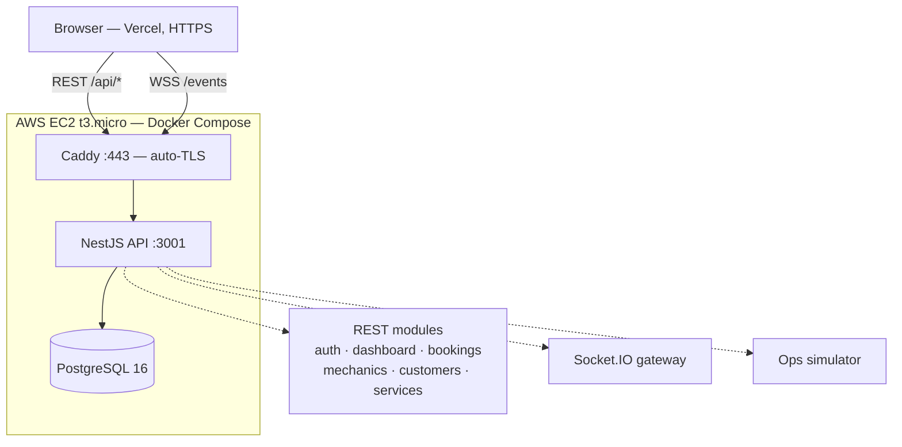
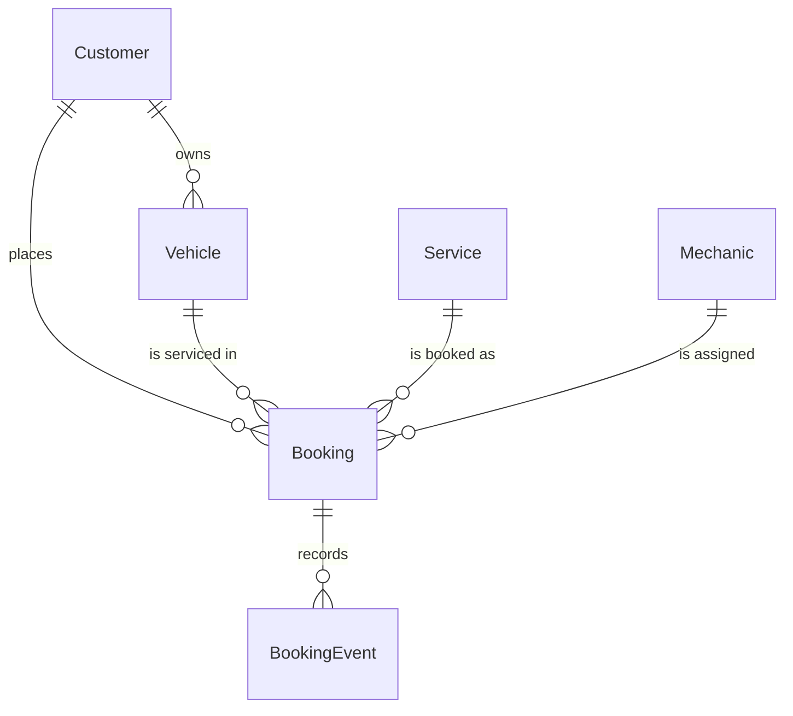

# PitStop Ops — Live Vehicle Service Operations Dashboard

[](https://github.com/suyash503/pitstop-ops-dashboard/actions/workflows/ci.yml)

A production-style operations dashboard for a vehicle service business: live bookings, mechanic
availability, customers and revenue, updating over WebSockets without a page reload.

Built as the Full Stack Developer Intern assignment for **Instant Mechanic**, and maintained as a
portfolio project.

> **Live demo** — sign in with `admin@pitstop.dev` / `password123` (or click the demo buttons)
>
> | | |
> |---|---|
> | Dashboard | **https://web-omega-tawny-74.vercel.app** |
> | API | **https://pitstop-ops.duckdns.org/api** |
> | API docs (Swagger) | **https://pitstop-ops.duckdns.org/api/docs** |

---

## Contents

- [What it does](#what-it-does)
- [Tech stack](#tech-stack)
- [Architecture](#architecture)
- [Data model](#data-model)
- [API](#api)
- [The live layer](#the-live-layer)
- [Design decisions and tradeoffs](#design-decisions-and-tradeoffs)
- [Running it locally](#running-it-locally)
- [Environment variables](#environment-variables)
- [Deployment](#deployment)
- [AI usage](#ai-usage)
- [What I would do next](#what-i-would-do-next)

---

## What it does

**Overview** — eight KPIs with real trend deltas against the preceding period, bookings and revenue
over time, status and service-category breakdowns, and a live activity feed. Range switches between
7 / 30 / 90 days.

**Bookings** — a full operations table: free-text search across booking code, customer, vehicle
registration, service and mechanic; multi-select status filter; service and mechanic filters; a date
range with presets; sortable columns; pagination; CSV export of the current selection. Filter state lives in the URL,
so a filtered view is a link you can send someone.

**Booking detail** — the complete audit timeline of a job, plus customer, vehicle and mechanic.
An ADMIN can advance the booking through the transitions the state machine actually allows; an OPS
user sees the control disabled with the reason.

**Mechanics** — who is on shift, what they are working on right now, jobs completed, rating.

**Customers** — booking count, vehicle count and lifetime value from completed work.

Everything updates live. Open the dashboard in two tabs and change a booking status in one.

---

## Tech stack

| Layer | Choice | Why |
|---|---|---|
| Frontend | Next.js 16 (App Router), TypeScript, Tailwind CSS v4, shadcn/ui | The brief's recommended stack; App Router with client components suits a dashboard that is almost entirely live data |
| Data fetching | TanStack Query | Cache-per-query with surgical updates from socket events, and a polling fallback for free |
| Charts | Recharts | Composable, themeable, no canvas |
| Backend | NestJS 11, TypeScript | Modules/DTOs/guards give the structure this brief is graded on; first-class Swagger and WebSocket support |
| Database | PostgreSQL 16 + Prisma 6 | Relational data with real joins; typed client and migrations |
| Realtime | Socket.IO | The brief's "best" tier, with automatic reconnection |
| Infra | Docker Compose, Caddy (auto-TLS), AWS EC2, Vercel | One box, one deploy command |

**Version pinning note.** Nest 12, Prisma 7 and TypeScript 6 were all current during the build and
all three were deliberately avoided: `@nestjs/throttler` does not yet support Nest 12, Prisma 7
removes `url` from the datasource block in favour of a config file plus driver adapters, and the
Nest 11 CLI crashes on TypeScript 6. The pinned versions are the ones where the whole ecosystem
agrees.

---

## Architecture



The API, database and reverse proxy run as three containers on a single EC2 instance. The frontend
is a separate Vercel deployment that talks to the API across origins with a CORS allowlist.

```
apps/
├── api/                     NestJS
│   ├── prisma/              schema, migrations, seed
│   └── src/
│       ├── auth/            JWT guards, roles, decorators
│       ├── bookings/        list, detail, transitions, CSV export
│       ├── dashboard/       aggregations
│       ├── mechanics/       roster and current jobs
│       ├── customers/       directory and lifetime value
│       ├── services/        service catalogue
│       ├── realtime/        Socket.IO gateway and event contract
│       ├── simulator/       ops traffic generator
│       ├── health/          liveness + DB check
│       └── common/          Prisma, cache, error filter, pagination, state machine
└── web/                     Next.js
    └── src/
        ├── app/             routes
        ├── components/      shell, charts, table, states
        └── lib/             API client, auth, socket, formatting
```

---

## Data model



A booking walks `PENDING → ASSIGNED → ON_THE_WAY → IN_PROGRESS → COMPLETED`, with `CANCELLED`
reachable from any non-terminal state.

**`BookingEvent` is the piece worth calling out.** It is an append-only audit trail of every status
transition. It makes the booking detail page a real timeline, and it means the live activity feed
renders rows that came from the database and survive a refresh, rather than toasts held in memory
that vanish. It also gives the whole system a single honest answer to "how did this booking get
here?"

### The seed is designed to hold up under inspection

700 bookings, 60 customers, 89 vehicles, 25 mechanics, 12 services across 5 categories. Beyond
hitting the brief's minimums, the data is internally consistent — because a dashboard aggregates
this data from several angles at once, and inconsistencies surface the moment anyone cross-checks
two screens:

- `jobsCompleted` is **counted from** each mechanic's actual completed bookings, never invented
- a mechanic holds **at most one in-flight job**, so "active mechanics" is a number that moves
  rather than a constant 25
- bookings older than 48 hours are always terminal — nothing from two months ago is still "on the way"
- volume rises linearly toward today and dips on Sundays
- cancelled jobs are stored at zero, since they are never invoiced
- every booking carries the full `BookingEvent` chain that produced its current status

Verified with assertions after seeding:

```sql
-- all four return 0
SELECT count(*) FROM bookings WHERE "createdAt" > now();
SELECT count(*) FROM bookings WHERE status='COMPLETED' AND "completedAt" IS NULL;
SELECT count(*) FROM bookings WHERE status='PENDING' AND "mechanicId" IS NOT NULL;
SELECT count(*) FROM (
  SELECT "mechanicId" FROM bookings
  WHERE status IN ('ASSIGNED','ON_THE_WAY','IN_PROGRESS') AND "mechanicId" IS NOT NULL
  GROUP BY 1 HAVING count(*) > 1) x;
```

---

## API

Base path `/api`. Interactive docs at **`/api/docs`** (Swagger UI, public).
Every endpoint except `POST /api/auth/login` and `GET /api/health` requires `Authorization: Bearer <token>`.

| Method | Endpoint | Notes |
|---|---|---|
| `POST` | `/api/auth/login` | Returns a JWT and the user |
| `GET` | `/api/auth/me` | The user behind the current token |
| `GET` | `/api/dashboard` | `?range=7d\|30d\|90d` — KPIs, time series, breakdowns, activity |
| `GET` | `/api/bookings` | `search, status, serviceId, mechanicId, city, from, to, sort, order, page, pageSize` |
| `GET` | `/api/bookings/:id` | Booking with its full event timeline |
| `PATCH` | `/api/bookings/:id/status` | **ADMIN only.** Validates the transition, records it, broadcasts it |
| `GET` | `/api/bookings/export` | CSV of the current selection, same filters, capped at 5000 rows |
| `GET` | `/api/mechanics` · `/api/mechanics/:id` | Roster with current/last job |
| `GET` | `/api/customers` · `/api/customers/:id` | Directory with lifetime value |
| `GET` | `/api/services` | Service catalogue (filter reference data) |
| `GET` | `/api/health` | Liveness + database ping; 503 if the DB is unreachable |

**Responses.** Lists return `{ data, meta: { page, pageSize, total, totalPages } }`. Errors return
one shape everywhere, so the frontend has a single failure branch to write:

```json
{ "statusCode": 400, "error": "Bad Request",
  "message": "Cannot move booking BK-2026-0699 from PENDING to COMPLETED",
  "path": "/api/bookings/.../status", "timestamp": "2026-09-01T06:27:09.117Z" }
```

**Metric semantics** are documented rather than assumed, because "total revenue" is ambiguous
otherwise:

- *Range-scoped*: total / completed / open / cancelled bookings, revenue, new customers
- *Point-in-time*: today's bookings (IST day boundary) and active mechanics
- Revenue counts **completed bookings only** — work in progress is not earned yet
- Deltas compare the selected window against the **immediately preceding window of equal length**
- "Open jobs" means everything not yet finished, not just the `PENDING` enum value — that is the
  number an operations team actually works from

---

## The live layer

`Socket.IO` on the `/events` namespace, authenticated at handshake with the same JWT the REST API
uses — an unauthenticated socket would be a side door around the HTTP guards.

| Event | Payload |
|---|---|
| `booking.created` | New booking summary |
| `booking.status_changed` | Transition, mechanic, amount, timestamps |
| `mechanic.status_changed` | Availability change |
| `stats.invalidated` | A nudge that cached aggregates are stale |

**The client handles these two different ways, deliberately.** Booking rows are *patched in place*:
the payload carries everything a row needs, so the table updates with no network round trip and no
flash through a loading state. Aggregates are *invalidated, not patched*: recomputing KPI deltas and
chart buckets on the client would duplicate backend logic and inevitably drift from it, and a
refetch is cheap and always agrees with the server.

**Graceful degradation.** If the socket cannot hold a connection, TanStack Query keeps polling every
30 seconds and the indicator in the header says `Reconnecting` or `Offline`. A dashboard that
silently stops updating is worse than one that admits it.

### About the simulator

A real deployment would receive status changes from a mechanic mobile app and new bookings from a
customer app. Neither exists here, so `SimulatorService` produces that traffic on a timer to make
the live layer demonstrable.

It is not a shortcut. It drives everything through `BookingsService`, so simulated traffic obeys the
same state machine, writes the same audit rows and fires the same events as a real operator action —
there is no separate "demo mode" code path. Set `SIMULATOR_ENABLED=false` and you have a fully
functional dashboard, just a quiet one.

---

## Design decisions and tradeoffs

**Transitions run in one transaction.** The booking row, its timeline entry and the mechanic rollup
are written together. A mechanic left "on job" for a job that already closed is exactly the kind of
drift that makes an ops board untrustworthy. Events are emitted only *after* the transaction
commits, so no client is ever told about a write that rolled back.

**One state machine, shared.** `common/booking-status.ts` is imported by both the HTTP endpoint and
the simulator, so neither can invent a transition the other rejects. The frontend mirrors it to
decide which buttons to offer — but the API is what actually decides.

**Guards are global, routes opt out.** Auth is on by default and switched off per route with
`@Public()`. The inverse would mean a forgotten decorator silently exposes an endpoint; this way it
fails closed.

**In-process cache, not Redis.** Dashboard aggregates are cached for 60s in a `Map`, and
**invalidated on write** rather than left to expire, so the cards cannot contradict a live event the
operator just watched arrive. With a single API instance a shared cache would add a network hop and
a moving part for nothing. With more than one instance this is wrong and Redis is the answer — which
is also the moment the Socket.IO Redis adapter becomes necessary.

**IST, not UTC.** The business runs on India time with no DST, so a fixed offset is exact. "Today"
and the daily chart buckets break at midnight IST. Without this, an evening booking in Mumbai lands
on the previous day in every chart.

**Whole rupees as `Int`.** Service pricing has no sub-rupee component, so `Int` avoids
floating-point drift and Prisma's `Decimal` serialisation, and keeps revenue aggregates as plain
SQL `SUM()`s.

**Aggregations are SQL.** `groupBy` and raw queries with `date_trunc`, never 700 rows pulled into
Node to be reduced. The daily series is zero-filled server-side, because a missing point makes a
line chart draw straight across a quiet day as though nothing happened.

**Token in `localStorage` — an honest compromise.** An httpOnly cookie is safer against XSS, but the
API is on a different origin to the Vercel frontend, so cookie auth would need `SameSite=None`, a
shared parent domain and CSRF protection on top. For an internal dashboard with a short-lived token,
the `Authorization` header is the simpler thing that is actually correct end to end. With a shared
domain, this should switch.

**The client-side route guard is not the security boundary.** The token lives in `localStorage`,
which Next.js middleware cannot read, so the gate runs in the browser. It only stops the dashboard
rendering an empty shell to a signed-out visitor — the API enforces authorisation independently on
every request, which is what actually matters. The OPS role gets a `403` from the API whether or not
the UI hid the button.

---

## Tests and CI

```bash
npm test --workspace apps/api        # 18 tests
```

Unit tests cover the logic where a mistake would be invisible until it mattered:
the booking state machine (no skipping steps, no reopening a cancelled job, no self-transitions),
CSV escaping (customer names containing commas and quotes), and the KPI delta calculation
(growth from a zero baseline is undefined, not `+100%`).

GitHub Actions runs three jobs on every push: API typecheck/test/build, web lint/build, and a
Docker image build. That last one exists because the two container bugs in this repo's history —
a missing workspace `node_modules` and a CLI resolving to the wrong Prisma major — were both
invisible outside the image.

---

## Running it locally

**Prerequisites:** Node 20+, Docker.

```bash
git clone https://github.com/suyash503/pitstop-ops-dashboard.git
cd pitstop-ops-dashboard
npm install
```

```bash
# 1. Postgres (host port 5433, to avoid colliding with a local install)
docker compose up -d db
```

```bash
# 2. API — migrate, seed, run on :3001
cd apps/api
cp .env.example .env
npx prisma migrate dev
npm run seed
npm run start:dev
```

```bash
# 3. Dashboard — run on :3000
cd apps/web
cp .env.example .env.local
npm install
npm run dev
```

Open <http://localhost:3000> and sign in with a demo account. Swagger is at
<http://localhost:3001/api/docs>.

| Account | Password | Role |
|---|---|---|
| `admin@pitstop.dev` | `password123` | ADMIN — can advance booking status |
| `ops@pitstop.dev` | `password123` | OPS — read-only |

---

## Environment variables

**`apps/api/.env`**

| Variable | Purpose |
|---|---|
| `DATABASE_URL` | Postgres connection string |
| `PORT` | API port (default `3001`) |
| `CORS_ORIGINS` | Comma-separated allowlist for REST **and** WebSocket. Must include the Vercel domain in production |
| `JWT_SECRET` | Signing secret — generate with `openssl rand -base64 48` |
| `JWT_EXPIRES_IN` | Token lifetime (default `8h`) |
| `SIMULATOR_ENABLED` | `true` / `false` |
| `SIMULATOR_INTERVAL_MS` | Tick interval (default `7000`) |

**`apps/web/.env.local`**

| Variable | Purpose |
|---|---|
| `NEXT_PUBLIC_API_URL` | API base URL **including** `/api` |
| `NEXT_PUBLIC_WS_URL` | Socket.IO origin, **without** `/api` |

---

## Deployment

Frontend on **Vercel** (root directory `apps/web`), backend on a single **AWS EC2 t3.micro** running
API, Postgres and Caddy under Docker Compose.

**One detail decides whether this works at all:** Vercel serves the frontend over HTTPS, so a
browser will refuse to call an `http://<ec2-ip>` API as mixed content, and the WebSocket fails the
same way. The backend needs a real hostname and a certificate. The setup uses a free DuckDNS
subdomain pointed at an **Elastic IP** (without which the instance's public IP changes on every
stop/start and the DNS record silently rots), with Caddy terminating TLS via Let's Encrypt
automatically.

Full runbook: [`docs/deployment.md`](docs/deployment.md).

---

## AI usage

The brief allows AI tools without restriction, and asks for an honest account. This project was
built in a working session with **Claude (Claude Code)**, used as a pair rather than a code
vending machine.

**What AI did:** generated the bulk of the boilerplate and first drafts — Prisma schema, NestJS
modules and DTOs, the seed generator, React components, Tailwind markup, and this README. It also
ran the verification loop: hitting endpoints with `curl`, querying Postgres directly to check the
seed's invariants, and driving the browser to confirm pages render.

**What that loop actually caught** — worth listing, because it is the difference between generated
code and working code:

1. **Future-dated bookings.** `setHours()` operates in local time, so seeded bookings on the current
   day were landing up to 13 hours in the future — which also inverted their event timelines. Caught
   by noticing a CSV row with `Created At 12:28 UTC` while the clock read `06:27 UTC`.
2. **Every mechanic permanently `ON_JOB`.** The seed let one mechanic hold several simultaneous
   in-flight jobs, so with ~60 open bookings across 25 mechanics, essentially all of them were busy
   and "active mechanics" was a dead constant. Fixed by modelling the real constraint: one job at a
   time, and unassignable work stays `PENDING`.
3. **A day-zero spike.** The original recency curve piled ~13% of all bookings onto today alone,
   which reads as a data-generation artifact rather than a growing business.
4. **Version incompatibilities** across Nest 12 / Prisma 7 / TypeScript 6, each of which broke the
   build in a different way.
5. **A `nextMechanicStatus` that was computed twice** — once for the database write and once for the
   broadcast — which would have let the two disagree.

**What I decided:** the stack and version pinning, the `BookingEvent` audit-trail model, metric
semantics (completed-only revenue, IST day boundaries, "open jobs" over raw `PENDING`), the
patch-rows/invalidate-aggregates split in the socket layer, deploying mid-build rather than last
because deployment is the highest-risk step, and the tradeoffs recorded above.

I can explain and modify every part of this codebase — which is the actual bar the brief sets.

---

## What I would do next

- **Redis** for the Socket.IO adapter and the aggregate cache, the moment there is more than one API
  instance — both current choices are correct for one and wrong for two.
- **RDS** instead of Postgres-in-a-container, for managed backups and point-in-time recovery.
- **Cursor pagination** on bookings; `OFFSET` degrades once the table is large.
- **httpOnly cookie auth** behind a shared parent domain, replacing the `localStorage` token.
- **Optimistic updates** on the status action, so the initiating client does not wait for its own echo.
- **A real assignment algorithm** — current allocation is least-loaded-in-city, where a real one
  would weigh distance, specialisation against the service, and shift end times.

---

## Licence

MIT
